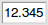
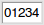

===========
WindowMenus
===========

.. |entry| image:: ../images/entry.png
   :align: bottom

.. |button| image:: ../images/button.png
   :align: bottom

.. |selector| image:: ../images/selector.png
   :align: bottom

Menu Assign peak
================

Open a popup window to assign the dimensions of the peak under the cursor to resonances

Menu Propagate assignments
==========================

Spread resonance assignments from the peak under the cursor to all selected peaks; where shifts match peak dimension positions

Menu Add to spin system
=======================

For the peak under the cursor, put all resonance assignments into the same spin system (resonance group)

Menu Predict Spin System Type
=============================

Predict the residue type of the primary spin system the peak under the cursor is assigned to

Menu Deassign selected peaks
============================

Clear all peak dimension assignments (to resonances) for all selected peaks (potentially in many windows)

Menu Clear all sequential links
===============================

Remove all sequential links between resonances assigned to the dimensions of the peak under the cursor

Menu Unite resonance positions
==============================

Based on the cursor peak having representative shift values for its assigned resonances, align all peak dimensions assigned to the same resonances to the same value(s)

Menu Selection Table
====================

Show a table of the peaks currently selected in spectrum windows

Menu Add new peak(s)
====================

Make a new peak at the current cursor location; makes peaks in all spectra displayed in the window

Menu Delete selected
====================

Delete the selected peaks, which may be in more than one window

Menu Set details
================

Set a textual comment for the peak under the cursor

Menu 0.0
--------

Set the figure-of-merit value for the peak under the cursor to 0.0; a "bad" peak

Menu 0.5
--------

Set the figure-of-merit value for the peak under the cursor to 0.5; a "mediocre" peak

Menu 1.0
--------

Set the figure-of-merit value for the peak under the cursor to 1.0; a "good" peak

Menu Snap selected peaks
========================

Re-center the selected peaks to their nearest spectrum intensity extremum, if within the normal peak finding tolerances

Menu Unalias peak
=================

Move the peak under the cursor to its real ppm value by adding or removing spectrum sweep widths, to unfold or unalias

Menu Unaliasing propagate
=========================

Set the selected peaks to be in the same spectrum (sweep width based) ppm range as the peak under the cursor

Menu Label Auto Arrange
=======================

For the selected peaks, automatically adjust the positions of the textual peak labels to avoid overlap; this operation is zoom-level dependent

Menu Label Position Reset
=========================

For the selected peaks, reset all textual peak labels to their default/unmoved positions

Menu Make intermediate peak
===========================

Make a new peak in the geometric center of the selected peaks; useful for COSY etc.

Menu Structure connections
==========================

Show any non-onebond connections described by the resonance assignments of the cursor peak in a graphical structure display

Menu Re-reference to this peak
==============================

Re-reference the points to ppm relationship for the spectra of the selected peaks by aligning peak positions; cursor peak is the reference

Menu Center z planes on peak
============================

Move the viewed region of the window so the peak under the cursor is in the center of the screen-orthogonal (Z) dimensions

Menu Use strips
---------------

Display the results of finding symmetry related (e.g. return) peaks using strips in the window

Menu Use tables
---------------

Display the results of finding symmetry related (e.g. return) peaks in a table

Menu Strip plot selected peaks
==============================

Make strips in the current window based on the locations of the selected peaks

Menu Zoom to selected peaks
===========================

Center the viewed region of the contour display to cover any peaks selected in the window

Menu Zoom to spin system peaks
==============================

Change the window view to see all peaks assigned to the same, primary spin system as the peak under the cursor

Menu Out by 2
-------------

Change the viewed region of the contour display to see twice as much on the X and Y axes

Menu In by 2
------------

Change the viewed region of the contour display to see half as much on the X and Y axes

Menu Zoom to selected peaks
---------------------------

Center the viewed region of the contour display to cover any peaks selected in the window

Menu Zoom to spin system peaks
------------------------------

Change the window view to see all peaks assigned to the same, primary spin system as the peak under the cursor

Menu Center here
================

Center the window so that its middle is at the current cursor location

Menu Up by 2
------------

Increase the contour base level ,for all displayed spectra, by a factor of two; move away from zero

Menu Down by 2
--------------

Decrease the contour base level, for all displayed spectra, by half; move away towards zero

Menu General...
---------------

Open a popup window to give fine control over spectrum contour levels

Menu Add Vertical strip
=======================

Add a new vertical strip/sub-division to the window

Menu Add Horizontal strip
=========================

Add a new Horizontal strip/sub-division to the window

Menu Delete vertical strip
==========================

Delete the vertical strip currently under the cursor

Menu Delete horizontal strip
============================

Delete the horizontal strip currently under the cursor

Menu Switch direction
=====================

Swap between vertical window strips and horizontal strips

Menu Add Mark
=============

Add a multi-dimensional cross mark at the current cursor location

Menu Add Horizontal ruler
=========================

Add a single horizontal line at the current cursor location

Menu Add Vertical ruler
=======================

Add a single vertical line at the current cursor location

Menu Delete marks
=================

Delete all multi-dimensional cross marks in all windows

Menu Delete rulers
==================

Delete all horizontal and vertical ruler (1D) lines in all windows

Menu Options
============

Open a popup window to alter the display settings for cross marks and ruler lines

Menu Clone
==========

Make a near identical copy of the current window

Menu Delete
===========

Delete the current window

Menu Print
==========

Export a PostScript, EPS of PDF rendering of the window for printing etc.

Menu Window properties
======================

Open a popup window to give fine control over spectrum window setting

Menu All
--------

Show navigation scrollbars on all axes of the current window

Menu Z only
-----------

Show navigation scrollbars for only the screen-orthogonal (Z) axes; removes X and Y

Menu None
---------

Remove all navigation scrollbars on all axes of the current window

Menu X & Y
----------

For both X and Y axes, superimpose 1D slice/transect traces, from the cursor location, on the crosshairs

Menu X
------

For only the X axis, superimpose 1D slice/transect traces, from the cursor location, on the crosshairs

Menu Y
------

For only the Y axis, superimpose 1D slice/transect traces, from the cursor location, on the crosshairs

Menu None
---------

Remove all 1D slice/transect traces superimposed on crosshairs

Menu Add side traces
====================

Add displays of one-dimensional spectrum slices/transects in panels at the edges of X and Y axes

Menu Remove side traces
=======================

Remove the one-dimensional spectrum slices/transects panels from the window edges 

Menu 50
-------

*Menu Documentation Missing*

Menu 100
--------

*Menu Documentation Missing*

Menu 150
--------

*Menu Documentation Missing*

Menu 200
--------

*Menu Documentation Missing*

Menu 250
--------

*Menu Documentation Missing*

